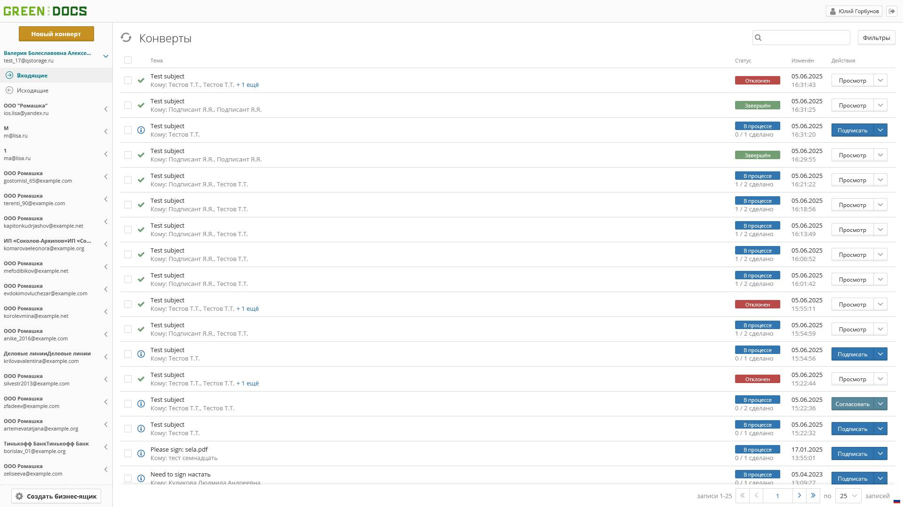
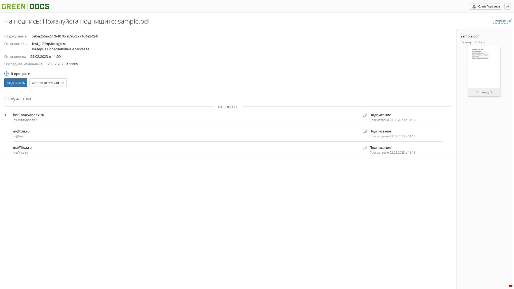

#  GreenDocs — инструмент для электронного подписания документов

GreenDocs — корпоративное веб-приложение для подписания и управления электронными документами. Основной функционал включает загрузку документов, интерактивное размещение полей для подписей, дат и других элементов, а также интеграцию с внешними сервисами для заверения подписи.

Из-за NDA код и точные детали не разглашаются

## 🛠 Стек технологий

- TypeScript
- React
- React Router
- Redux Toolkit
- Axios
- Formik + Yup
- SCSS Modules
- i18n
- JWT
- Webpack
- Docker
- GitLab CI/CD

## 🧩 Возможности

- Просмотр и управление документами с удобной фильтрацией
- Табличные представления с возможностью массовых операций
- Конструктор "конверта" с возможностью загрузки документов и интерактивного размещения области для подписей, даты, текста и других элементов
- Динамические формы с валидацией и подсказками
- Интеграция с внутренними API для загрузки и сохранения данных

## 🖥️ Интерфейс и функционал

Ниже представлена часть экранов из приложения GreenDocs:

### Основной экран приложения

_Экран с фильтрацией, статусами и массовыми действиями._

### Карточка документа

_Экран с краткой информацией и отображением движения по документу_

### Третий этап конструктора конверта

_Экран с интерактивным размещением областей на загруженном документе_

### Панель настроек профиля пользователя

_Экран с формой для изменения данных учетной записи и прочих настроек_
